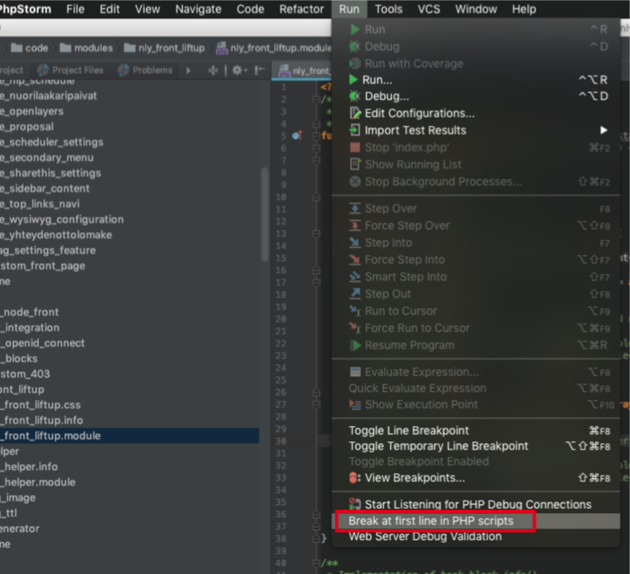
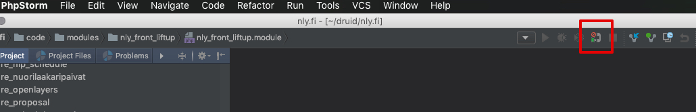
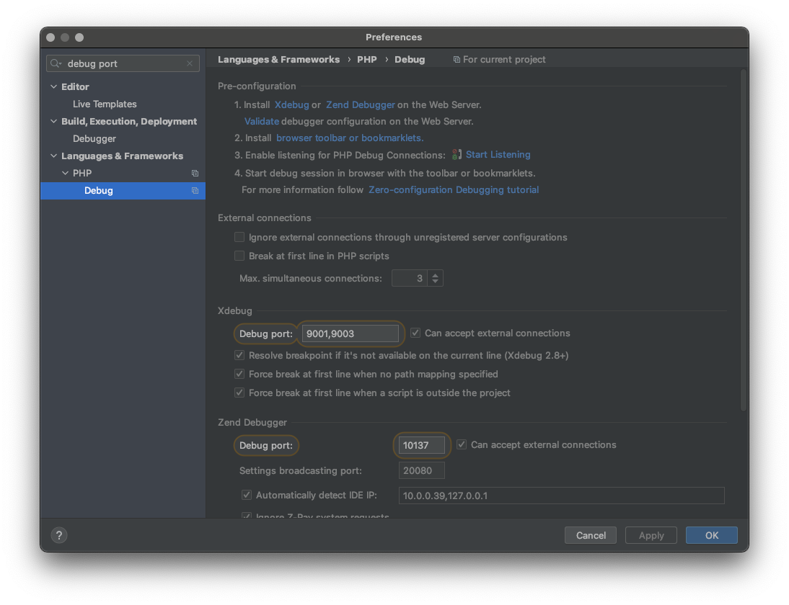
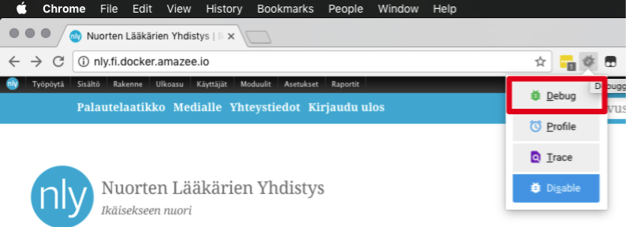
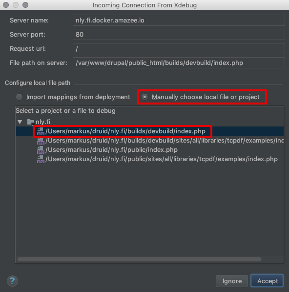
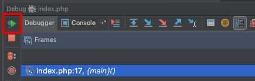
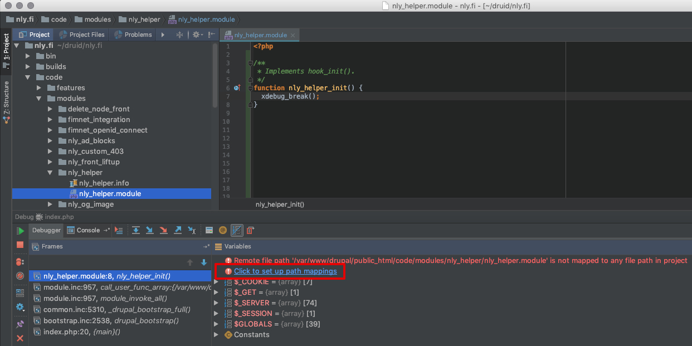
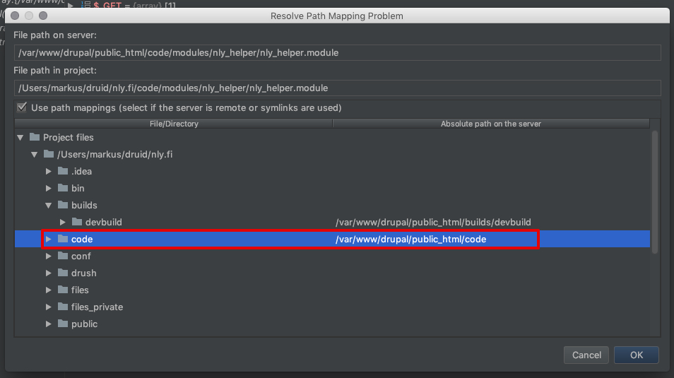
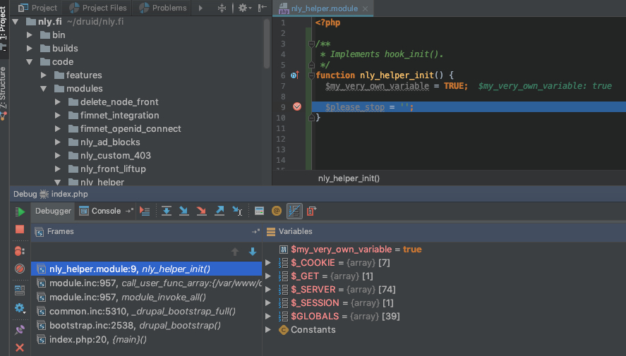

# Amazee.io + PhpStorm + Xdebug

How to configure Xdebug when using Docker and amazee.io.

## Links

- [Amazee.io documentation](https://docs.amazee.io/tools/xdebug.html#xdebug)
- [PhpStorm documentation](https://confluence.jetbrains.com/display/PhpStorm/Zero-configuration+Web+Application+Debugging+with+Xdebug+and+PhpStorm)

## What is needed to use Xdebug

- PhpStorm
- Xdebug module is properly loaded (See Amazee.io documentation)
- Xdebug helper plugin for your favorite browser.
    - Chrome extension "Xdebug helper" is used in this example.

## How to configure PhpStorm

1. Open your project in PhpStorm and enable "Break at first line in PHP scripts"

    

2. Enable listening for PHP Debug Connections.
_Can also be enabled from `Run -> Start Listening for PHP Debug Connections`_

    

3. Enable Xdebug in your `docker-composer.yml` file by adding `XDEBUG_ENABLE: "true"`. You can then choose to add either of the following lines in that same file:

    3.1. `DOCKERHOST: host.docker.internal` OR

    3.2.a) `XDEBUG_CONFIG: "remote_port=9001 remote_host=host.docker.internal remote_connect_back=0"`

    3.2.b) (In the latter case) select in PhpStorm menu `Preferences...` and type "debug port" to the search window. Add the ports respectively.

    Note: Port may vary according to your Xdebug version: https://www.jetbrains.com/help/phpstorm/configuring-xdebug.html#integrationWithProduct "By default, Xdebug 2 listens on port 9000. For Xdebug 3, the default port has changed from 9000 to 9003."
    

4. Open your browser and enable your favorite Xdebug helper tool.
_Make sure your helper tool IDE key is PHPSTORM._
_In Xdebug helper (Chrome extension) you can change it by right clicking the icon, choosing options and changing the IDE key by selecting it from the select list."_

    

5. Open or refresh your website in the browser and wait for PhpStorm to wake up. Sometimes you might need to open PhpStorm manually.
   
    5.1. Select: *Manually choose local file or project*
   
    5.2. Select: *builds/devbuild/index.php*

    

6. Let PhpStorm to resume the program by clicking the green play button. You might need to click it multiple times.

    

7. Disable "Break at first line in PHP scripts". See image in part 1.

8. Navigate to your custom code in code-folder and add `xdebug_break();` to some module/function which you know will be loaded. See image at 8.
_Adding a normal PhpStorm breakpoint might not work before the path mappings are set._

9. Refresh your browser and wait for PhpStorm to wake up. Again, you might need to open PhpStorm manually.
     8.1. Click: *Click to set up path mappings*

    

10. PhpStorm will open a dialog where you can set the correct path for your custom file. Instead of finding the file from the directory tree, look for code -folder and set the correct absolute path for the code folder. See image below.

    

11. Remove `xdebug_break();` and replace it with PhpStorm breakpoint. Refresh the browser and enjoy debugging, because you're done!

    
