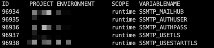
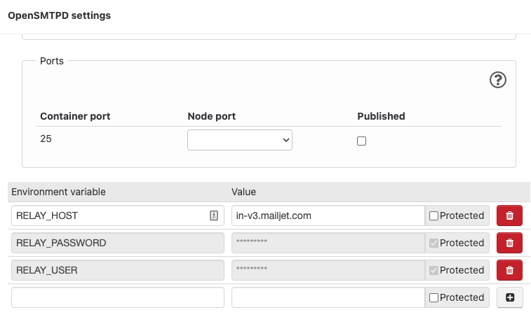

# How to send emails in Drupal?

Sending mails is as hard as having a working printer.

## Requirements

First, please evaluate what is the actual need for sending emails in a Drupal site:

1. Just Drupal user password resets (Forgotten password)
2. Email content, order confirmation etc (related to business logic)

If use case is the 1st, then probably there is no need to install any modules to Drupal.

For the 2nd; there are some modules which might be needed:

- [Mail System ↗️](https://www.drupal.org/project/mailsystem) to control what is used as Formatter and Sender
- [Mime Mail ↗️](https://www.drupal.org/project/mimemail) to use HTML mails

## Stonehenge

On your local environments you want to send emails to [Mailpit](https://mailpit.docker.so).

This can be done e.g. with adding this ENV variable to your Docker service having PHP:

On druidfi Docker images (app service):

```yaml
PHP_SENDMAIL_PATH: /usr/sbin/sendmail -S host.docker.internal:1025 -t
```

On Lagoon images (cli and php service):

```yaml
SSMTP_MAILHUB: host.docker.internal:1025
```

On Wodby images (php service):

```yaml
PHP_SENDMAIL_PATH: /usr/sbin/sendmail -S host.docker.internal:1025
SSMTP_MAILHUB: host.docker.internal:1025
```

## Lagoon

- In Lagoon we can use "SMTP relay" technique as a transport



## Wodby

- In Lagoon we can use "SMTP relay" technique as a transport
- Read more on [Wodby docs](https://wodby.com/docs/1.0/infrastructure/mail-delivery/)



## Custom

In a custom hosting environment like virtual server or other custom env you can try to
configure sendmail to use an external SMTP service.

`sendmail_path` setting can be found from php.ini file(s).

## Testing

You can test sendmail working correctly with login to PHP container and running following commands (example):

- `to@druid.fi` should be you - send test message to yourself
- `from@druid.fi` should be the validated sender domain or email in Mailjet/AWS/Sendgrid etc

Using PHP (which uses sendmail):

```console
php -r 'mail("to@druid.fi", "Test subject", "This is our test message", "From: from@druid.fi"); echo "sent";'
```

Or using verbose mode:

```console
php -d "sendmail_path=/usr/sbin/sendmail -v -S host.docker.internal:1025 -t" -r 'mail("to@druid.fi", "Test subject", "This is our test message", "From: from@druid.fi");'
```

Using Sendmail directly:

First create a file called `email.txt` with following content:

```
From: sender@example.com
To: recipient@example.com
Subject: Email Subject

This is the body of the email.
It can contain multiple lines of text.
```

```console
cat email.txt | sendmail -S host.docker.internal:1025 -v -f to@druid.fi from@druid.fi
```
