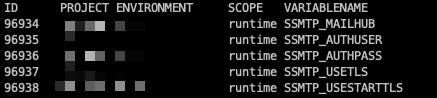
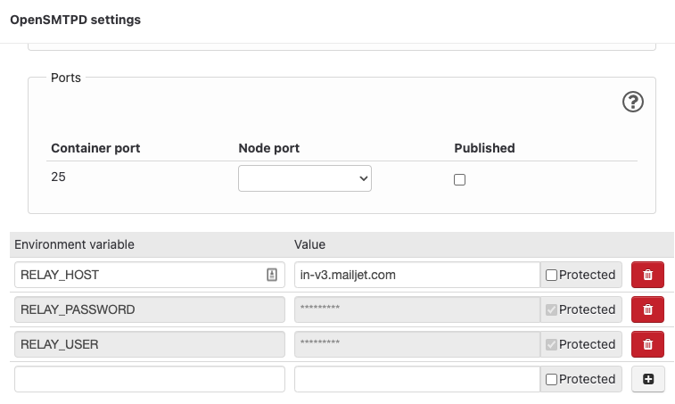

# How to send emails in Drupal?

Sending mails is as hard as having a working printer.

## Requirements

First, please evaluate what is the actual need for sending emails in a Drupal site:

1. Just Drupal user password resets (Forgotten password)
2. Email content, order confirmation etc (related to business logic)

If use case is the 1st, then probably there is no need to install any modules to Drupal.

For the 2nd; there are some modules which might be needed:

- [Mail System](https://www.drupal.org/project/mailsystem) to control what is used as Formatter and Sender
- [Mime Mail](https://www.drupal.org/project/mimemail) to use HTML mails

## Lagoon

- In Lagoon we can use "SMTP relay" technique as a transport

## Wodby

- In Lagoon we can use "SMTP relay" technique as a transport
- Read more on [Wodby docs](https://wodby.com/docs/1.0/infrastructure/mail-delivery/)

## Custom

In a custom hosting environment like virtual server or other custom env you can try to
configure sendmail to use an external SMTP service.

`sendmail_path` setting can be found from php.ini file(s).
