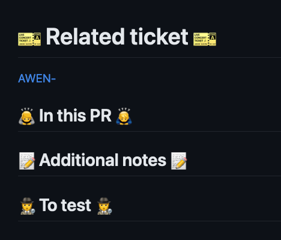

# Pull request template

Having a PR template makes it convenient to do new pull requests, saves time and keeps the format uniform.

## Creating a PR template

- Create a `pull_request_template.md` file inside the projects .github folder.
  - Inside the file write what you want to have in the template(see suggestion below).
```
## Related ticket / conversation


## In this PR


## Testing instructions


```
- Commit the changes to the repository

### For more information
[Creating a pull request template for your repository](https://docs.github.com/en/communities/using-templates-to-encourage-useful-issues-and-pull-requests/creating-a-pull-request-template-for-your-repository)

### Examples
- [AWEN](https://github.com/druidfi/awen/blob/dev/.github/pull_request_template.md)
